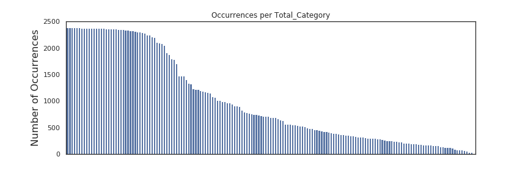

# KICKSTARTER - Predicting Campaign Success
​
This is a small Data Science project as part of the Data Science bootcampt [neuefische](https://github.com/JonJae/nf_1st_project/blob/master/neuefische.de), Fall 2020.  The main aim of this project are a throughout Exploratory Data Analysis including Data Cleaning and Data Exploration as well as the construction and validation of various Machine Learning Classification Models. 
​
## About the Business Case 
​
In recent years, the range of funding options for projects created by individuals and small companies has expanded considerably. In addition to savings, bank loans, friends & family funding and other traditional options, crowdfunding has become a popular and readily available alternative.
​
Kickstarter, founded in 2009, is one particularly well-known and popular crowdfunding platform. It has an all-or-nothing funding model, whereby a project is only funded if it meets its goal amount; otherwise no money is given by backers to a project. A huge variety of factors contribute to the success or failure of a project. Some of these can be quantified or categorized, which allows for the construction of a machine learning model to attempt to predict whether a campaign will succeed or not.
​
## Data Exploration - Key Findings
​
**Synthetic cap of number of occurrences** at about 2400 projects in an Subcategory. 
​

​
​
​
​
​
## Models 
​
his project focuses on the **F1-Score** as target metric. Evaluated Models and their F1 Score: 
​
- Random Forrest: 0.812
- Logistic Regression: 0.656
- XGBoost: 0.787
- SVM: 0.686
​
**Feature Importance**
​
​
​
## Files
​
- Slide deck as [PDF](https://datalore.jetbrains.com/notebook/kSrxGEhQhJhKp2WnAKheaO/ltr546h3DRheqkvfSmMWwi/pdf/nf-Project02_KICKSTARTER_Project_Presentation.pdf) pushed to GitHub designed for non-technical stakeholders  (10min  presentation).
- Jupyter notebook following PEP8 designed for data science / technical audience.
​
## Future Work
​
- Feature Engneering: **Average USD-Pledge per Subcategory** to evaluate better supported subcategories.
- **ROC Curve**s are another way to illustrate the  performance of a specific model. Compared to the F1-Score, ROC Curves  contain more information and, hence, generate a deeper understanding of  the model's performance. They are especially great for investigating and comparing different models.  Besides, ROC curves are a great tool for  communicating results. Hence, in future work, ROC curves should generate a deeper understanding of the model's performance.
- The used **confusion matrix** fulfills its purpose:  comparing the predicted and actual successes and failures. The  color-coding is a great addition as it shows the severity of various  values at a glance. Nevertheless, percentage values and labeling would  be a great addition and is part of future work.
- Aiming for the stars: The **blurb** (a string description) and the **photo** (mostly different versions of the main image) have been droped in the  current analysis earlie on. Splitting the blurb into its fragments could potentially surface a corrolation between success and metaphorical,  postive words. In addition, Analysing the images, e.g., for items or for color palets, could bring great insights and be a very steep but  rewarding learning curve.
​
​
​
## Data Source
​
The data was crawled by the company [WebRobots](https://webrobots.io/) ('We provide B2B web crawling and scraping services') directly from the [Kickstarter-Website](https://www.kickstarter.com/).
​
Current data (crawled within the timeframe 2014-04-22 to 2020-08-13) can be found there.
 All of the datasets contains snapshots of all kickstarter-projects (from the beginning in 2009) in the status at the crawl-date.

